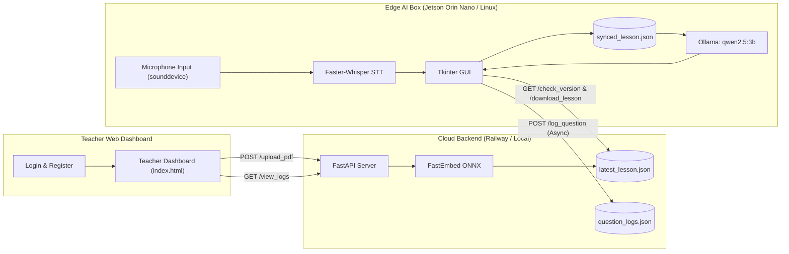

# AI Learning Box (Smart Classroom Assistant)

ระบบผู้ช่วยสอนอัจฉริยะสำหรับห้องเรียน ด้วยสถาปัตยกรรมแบบ **Decoupled Cloud-to-Edge** ช่วยให้กล่อง AI ในห้องเรียนสามารถทำงานแบบ **Offline ได้ 100% (STT + RAG + LLM + GUI)** พร้อมระบบซิงค์บทเรียนและบันทึกประวัติคำถามขึ้น Cloud ได้อย่างมีประสิทธิภาพ

---

## 🏗️ โครงสร้างสถาปัตยกรรมของระบบ



---

## 📁 โครงสร้างโปรเจกต์ (Project Structure)

```text
aibox/
├── backend/                  # ☁️ Cloud Backend (FastAPI)
│   ├── __init__.py
│   └── server.py             # API หลังบ้าน (PDF Chunking, Vector Embedding, Question Logging)
│
├── edge/                     # 🤖 Edge AI Box (Jetson Orin Nano / Linux)
│   ├── sync_and_ask.py       # สคริปต์หลัก: GUI + ไมค์ + Faster-Whisper (STT) + Offline RAG + Ollama
│   └── requirements.txt      # Dependencies สำหรับบอร์ด Edge (sounddevice, faster-whisper ฯลฯ)
│
├── frontend/                 # 🌐 Teacher Web Dashboard (โฉมใหม่)
│   ├── login.html            # หน้าเข้าสู่ระบบ
│   ├── register.html         # หน้าสมัครสมาชิกผู้สอน
│   ├── index.html            # หน้าแดชบอร์ดจัดการบทเรียน (Drag & Drop, Progress Bar, Logs, FAQ)
│   ├── style.css             # สไตล์ชีตหลักสำหรับหน้าแดชบอร์ด
│   ├── auth.js               # ระบบ Authentication จัดการข้อมูลผู้ใช้
│   └── dashboard.js          # สคริปต์ควบคุมและแสดงข้อมูลโปรไฟล์ผู้สอน
│
├── data/                     # 📂 ตัวอย่างข้อมูลสำหรับทดสอบ
│   └── sample.pdf            # ไฟล์ PDF ตัวอย่าง
│
├── server.py                 # Entrypoint สำหรับ Deploy บน Railway
├── Procfile                  # การตั้งค่า Start Command สำหรับ Railway
├── requirements.txt          # Python Dependencies สำหรับ Backend / Railway
├── .gitignore                # การละเว้นไฟล์ชั่วคราว, แคช และไฟล์ข้อมูล Runtime
└── README.md                 # เอกสารคู่มือการใช้งานระบบ
```

---

## 🔗 ข้อมูลการเชื่อมต่อ API Endpoints

- **Cloud Base URL:** `https://web-production-3eb56.up.railway.app`
- **Local Base URL:** `http://localhost:8000` (หรือ `http://127.0.0.1:8000`)
- **Interactive Swagger Docs:** `http://localhost:8000/docs` หรือ `https://web-production-3eb56.up.railway.app/docs`

| Method | Endpoint | ผู้ใช้งาน | คำอธิบาย |
| :--- | :--- | :--- | :--- |
| `POST` | `/upload_pdf` | Teacher Dashboard | อัปโหลดไฟล์ PDF แปลงเป็น Vector บทเรียนล่าสุด |
| `GET` | `/check_version` | Edge AI Box | ตรวจสอบหมายเลขเวอร์ชันของบทเรียนว่ามีอัปเดตใหม่หรือไม่ |
| `GET` | `/download_lesson` | Edge AI Box | ดาวน์โหลด Chunks และ Embedding ทั้งหมดมาแคชในเครื่อง |
| `POST` | `/log_question` | Edge AI Box | ส่งประวัติคำถาม-คำตอบกลับไปเก็บบน Server (แบบ Background Thread) |
| `GET` | `/view_logs` | Teacher Dashboard | ดึงประวัติคำถามและคำตอบทั้งหมดมาแสดงผลบน Dashboard |

---

## 🚀 วิธีการติดตั้งและรันใช้งาน

### 1. ฝั่ง Cloud Backend (รันบนเครื่อง Local)
```bash
# 1. ติดตั้ง dependencies
pip install -r requirements.txt

# 2. รัน FastAPI Server แบบ Hot-reload
uvicorn backend.server:app --reload --port 8000
```
> ทดสอบ API ได้ทันทีผ่านเบราว์เซอร์ที่ [http://localhost:8000/docs](http://localhost:8000/docs)

---

### 2. ฝั่ง Teacher Web Dashboard (Frontend)
1. เปิดไฟล์ `frontend/login.html` บนเบราว์เซอร์
2. หากยังไม่มีบัญชี ให้กด **"สมัครสมาชิก"** (`register.html`) เพื่อสร้างบัญชีผู้สอน
3. เข้าสู่ระบบเพื่อเข้าสู่หน้า **Teacher Dashboard (`index.html`)**
   * **อัปโหลดชีตสอน:** ลากไฟล์ PDF มาวางในกล่องอัปโหลด จะมี Progress Bar แสดงสถานะการแปลง Vector แบบ Real-time
   * **ดูสถิติและประวัติ:** ตรวจสอบคำถามที่นักเรียนถามเข้ามาจากห้องเรียน
4. **การสลับ Server:**
   * แก้ไขตัวแปร `BASE_URL` ใน `frontend/index.html` (บรรทัดที่ 922) เลือกระหว่าง Local (`http://127.0.0.1:8000`) หรือ Railway (`https://web-production-3eb56.up.railway.app`)

---

### 3. ฝั่ง Edge AI Box (Jetson Orin Nano / Ubuntu Linux)

#### ขั้นตอนที่ 1: ติดตั้ง System Packages (สำหรับเสียงและ GUI)
```bash
sudo apt-get update
sudo apt-get install -y portaudio19-dev python3-tk ffmpeg alsa-utils
```

#### ขั้นตอนที่ 2: ติดตั้ง Python Dependencies
```bash
pip install -r edge/requirements.txt
```

#### ขั้นตอนที่ 3: เตรียมโมเดล LLM ใน Ollama
```bash
# ติดตั้ง Ollama และดึงโมเดลภาษา
ollama pull qwen2.5:3b
# (หรือหากเครื่องมีแรมน้อย ให้ใช้ qwen2.5:0.5b)
```

#### ขั้นตอนที่ 4: รันระบบห้องเรียนอัจฉริยะ
```bash
python3 edge/sync_and_ask.py
```
* ระบบจะเปิดหน้าต่าง GUI ขึ้นมา
* ตรวจสอบและดาวน์โหลดบทเรียนล่าสุดจากเซิร์ฟเวอร์อัตโนมัติ
* กดปุ่ม **"🎙️ กดเพื่อพูดถาม"** เพื่อบันทึกเสียงคำถาม ระบบจะถอดเสียงภาษาไทยด้วย Faster-Whisper, ค้นหาบทเรียนด้วย FastEmbed RAG, และสร้างคำตอบผ่าน Ollama ทันทีแบบไม่ต้องพึ่งพาอินเทอร์เน็ต
