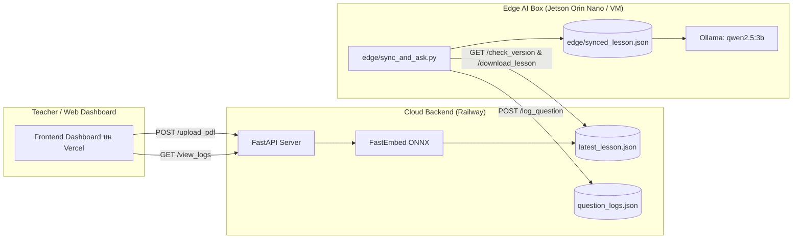

# AI Learning Box (Smart Classroom Assistant)

ระบบผู้ช่วยสอนอัจฉริยะสำหรับห้องเรียน ด้วยสถาปัตยกรรมแบบ **Decoupled Cloud-to-Edge** ช่วยให้กล่อง AI ในห้องเรียนสามารถทำงานแบบ Offline ได้ และซิงค์บทเรียน/บันทึกคำถามกับ Cloud ได้อย่างมีประสิทธิภาพ

---

## 🏗️ โครงสร้างสถาปัตยกรรมของระบบ



---

## 📁 โครงสร้างโปรเจกต์ (Project Structure)

```text
aibox/
├── backend/                  # ☁️ Cloud Backend (FastAPI Deploy บน Railway)
│   ├── __init__.py
│   ├── server.py             # FastAPI App (PDF Chunking, Vector Embedding, Question Logging)
│   └── requirements.txt      # Dependencies สำหรับ Cloud Backend
│
├── edge/                     # 🤖 Edge AI Box (Jetson Orin Nano / VM Client)
│   ├── sync_and_ask.py       # สคริปต์ Offline RAG + เชื่อมต่อ Ollama (qwen2.5:3b)
│   └── requirements.txt      # Dependencies สำหรับ Edge Client
│
├── frontend/                 # 🌐 Web Dashboard สำหรับทดสอบ API
│   └── web_aibox.html        # หน้าเว็บสำหรับคุณครู (Upload PDF & ดูประวัติคำถาม)
│
├── data/                     # 📂 ตัวอย่างข้อมูล
│   └── sample.pdf            # ตัวอย่างไฟล์ PDF สำหรับทดสอบระบบ
│
├── server.py                 # Entrypoint หลักสำหรับ Railway (เชื่อมต่อไปที่ backend/server.py)
├── Procfile                  # ไฟล์สั่งรันสำหรับ Railway
├── requirements.txt          # Root requirements สำหรับ Railway deployment
├── .gitignore                # การละเว้นไฟล์ temp, cache และ local runtime json
└── README.md                 # เอกสารแนะนำและคู่มือการใช้งาน
```

---

## 🔗 ข้อมูลการเชื่อมต่อ Cloud Backend (Railway)

- **API Base URL:** `https://web-production-3eb56.up.railway.app`
- **Swagger API Docs (คู่มือทดสอบ):** `https://web-production-3eb56.up.railway.app/docs`

### Key Endpoints สำหรับ Frontend / Edge:
| Method | Endpoint | สำหรับ | คำอธิบาย |
| :--- | :--- | :--- | :--- |
| `POST` | `/upload_pdf` | Frontend | อัปโหลดไฟล์ PDF แปลงเป็น Vector บทเรียนล่าสุด |
| `GET` | `/check_version` | Edge Box | ตรวจสอบหมายเลขเวอร์ชันของบทเรียน |
| `GET` | `/download_lesson` | Edge Box | ดาวน์โหลด Chunks และ เวกเตอร์บทเรียนทั้งหมด |
| `POST` | `/log_question` | Edge Box | ส่งประวัติคำถามและคำตอบขึ้นไปเก็บบน Cloud |
| `GET` | `/view_logs` | Frontend | ดึงประวัติคำถามและคำตอบทั้งหมดไปแสดงผล |

---

## 🚀 วิธีการติดตั้งและรันใช้งาน

### 1. ฝั่ง Cloud Backend (ทดสอบในเครื่อง)
```bash
# ติดตั้ง dependencies
pip install -r backend/requirements.txt

# รัน FastAPI Server
uvicorn backend.server:app --reload --port 8000
```

### 2. ฝั่ง Edge AI Box (Jetson Orin Nano / Local VM)
1. ติดตั้ง Ollama และดึงโมเดล `qwen2.5:3b`:
   ```bash
   ollama run qwen2.5:3b
   ```
2. ติดตั้ง dependencies:
   ```bash
   pip install -r edge/requirements.txt
   ```
3. รันสคริปต์ถาม-ตอบ:
   ```bash
   python3 edge/sync_and_ask.py
   ```

### 3. ฝั่ง Web Dashboard สำหรับทดสอบ
เปิดไฟล์ `frontend/web_aibox.html` บนเบราว์เซอร์ได้โดยตรงเพื่อทดสอบการอัปโหลด PDF และตรวจสอบผลลัพธ์
